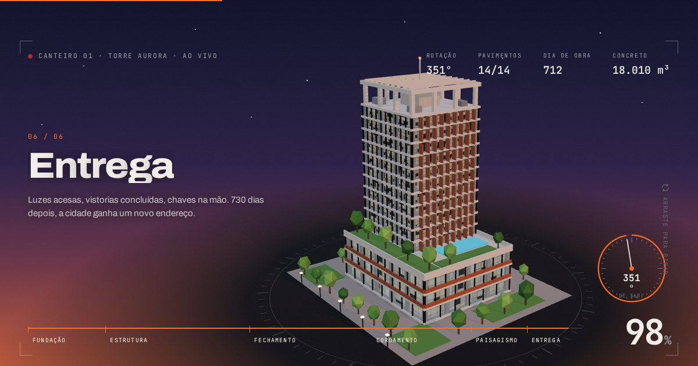

# Vértice — Engenharia & Construção

Site institucional animado para construtora, feito com **GSAP** (ScrollTrigger, ScrollSmoother, SplitText, DrawSVG) e **Three.js**.



## O que tem de diferente

- **Obra em 360°**: ao rolar a página, um edifício 3D gira uma volta completa enquanto é construído. São seis fases: fundação, estrutura, fechamento, coroamento, paisagismo e entrega. O guindaste sobe junto com a obra e é desmontado no fim. Na entrega, a cena vira fim de tarde e as janelas acendem. Dá para arrastar a obra para girá-la.
- **Filme em motion design** ("Do traço ao skyline"): um curta de 36 segundos renderizado ao vivo em SVG + GSAP, sem nenhum arquivo de vídeo. Tem player próprio (play/pause, linha do tempo arrastável com capítulos e tela cheia) e começa sozinho quando aparece na tela.
- **Narração com voz do ElevenLabs**: ao ativar o som, um narrador (voz "Lucas", português do Brasil) fala uma frase por cena, sincronizada com a linha do tempo, mesmo ao pausar ou arrastar. A trilha sonora é sintetizada com Web Audio e abaixa sozinha enquanto a voz fala.
- Parallax em camadas no hero (com rolagem e com o mouse), preloader, cursor personalizado e botões magnéticos.
- Serviços em rolagem horizontal, projetos com revelação e parallax interno, linha do tempo do método e faixas de texto que aceleram com a velocidade da rolagem.
- Formulário de orçamento que abre o WhatsApp com a mensagem pronta.
- Totalmente responsivo (celular, tablet e desktop). Respeita `prefers-reduced-motion`.

## Como rodar

O site não precisa de build nem de `npm install`: são arquivos estáticos.

```bash
# qualquer servidor estático serve, por exemplo:
npx serve .
# ou
python3 -m http.server 8080
```

Depois é só abrir `http://localhost:8080`. Também funciona abrindo o `index.html` direto no navegador.

### Publicar no GitHub Pages

1. No GitHub, vá em **Settings → Pages**.
2. Em *Source*, escolha **Deploy from a branch**, selecione a branch e a pasta `/ (root)`.
3. Salve. Em cerca de um minuto o site fica no ar em `https://<usuario>.github.io/<repositorio>/`.

## Personalização

| O quê | Onde |
| --- | --- |
| WhatsApp, telefone e e-mail | objeto `CONFIG` no topo de `js/main.js` |
| Nome da empresa, textos e seções | `index.html` |
| Cores e fontes | variáveis em `:root` no topo de `css/style.css` |
| Ilustrações dos projetos | `js/art.js`. Para usar fotos reais, troque `<div class="proj__img" data-art="...">` por `` |
| Fases da obra 3D (textos) | lista `.hud__phases` no `index.html` |
| Modelo 3D, cronograma e câmera | `js/building.js` |
| Cenas do filme | `js/film.js` |
| Narração | `assets/audio/narracao.mp3` (faixa única com as 8 falas já no tempo certo); os horários de cada fala estão em `LINES` no `js/film.js` |

> Os dados atuais (nome "Vértice", telefone, CNPJ, projetos e números) são **fictícios**. Troque pelos dados reais da sua empresa antes de publicar.

## Estrutura

```
index.html          página única
css/style.css       estilos e layout responsivo
js/main.js          orquestra as animações de rolagem (GSAP)
js/building.js      cena 3D da obra (Three.js)
js/film.js          o filme em motion + player + trilha sonora
js/art.js           skylines e ilustrações procedurais
vendor/             GSAP 3.15 e um build enxuto do three.js r186
assets/             favicon, imagem de compartilhamento e narração (audio/)
```

## Créditos

- [GSAP](https://gsap.com), licença padrão (gratuita, inclusive para uso comercial)
- [three.js](https://threejs.org), licença MIT
- Fontes Archivo e JetBrains Mono, via Google Fonts
